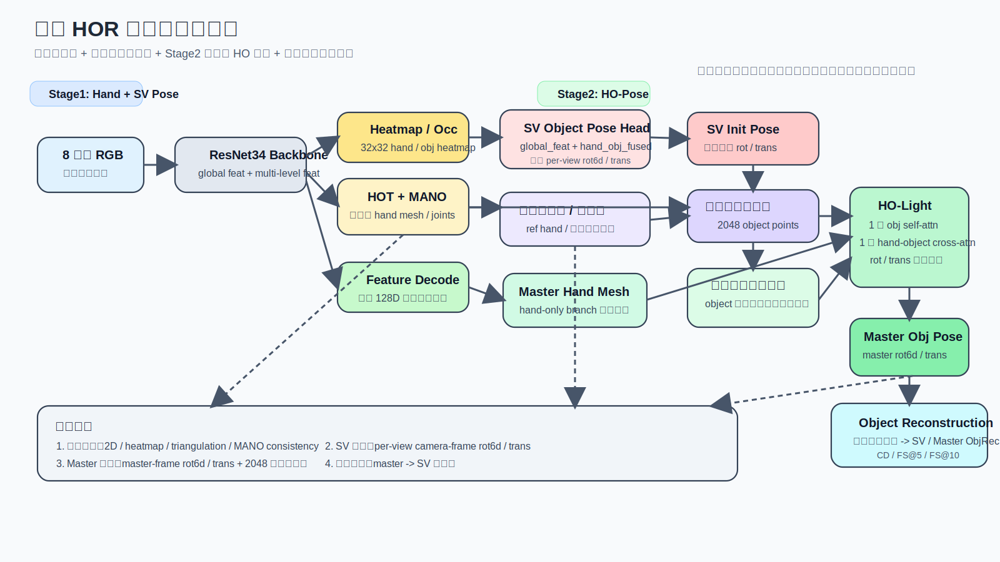
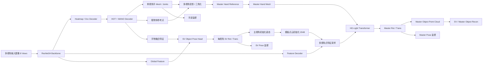

# 当前 HOR 方法总结、瓶颈分析与改进方向

日期：2026-04-13

## 1. 方法定位

当前方法不是一个纯单目、纯生成式的手持物体重建框架，而是一个更偏向于：

- 多视角输入
- 手部几何强引导
- 已知物体模板点云驱动
- 分阶段优化的手物联合恢复框架

如果用一句话概括，当前方法更接近：

**多视角手引导的模板感知物体姿态与点云恢复方法**

这和 HORT 的核心定位并不完全相同。

- HORT：单目 RGB，恢复手持物体稠密点云
- 当前 HOR：多视角 RGB，以手为主线，结合物体模板点云与姿态回归，恢复 master 空间下的手物结果

因此，在 DexYCB 这类“已知物体模板 + 多视角”的设定下，当前方法理论上具有比 HORT 更高的上限；但由于监督链条更长、坐标系更多、姿态定义更复杂，训练难度也显著更高。

## 2. 当前方法的整体流程

### 2.1 输入与基础设定

- 输入为 `N=8` 个视角的裁剪 RGB 图像
- 每个样本都有：
  - 当前视角相机内外参
  - 手部 3D / 2D 标注
  - 物体模板点云
  - 每个视角的物体姿态标签
  - master 视角下的物体姿态标签
- 当前默认配置见：
  - `config/release/HOR_DexYCBMV.yaml`

核心训练设定：

- `stage1`: `epoch < STAGE1_END_EPOCH`
- `stage2`: `epoch >= STAGE1_END_EPOCH`
- `stage2` 有 warmup
- `SV self-distill` 默认延后到后期才开启
- 验证时采用双模式：
  - 普通验证：2048 点快速评估
  - 最后一次验证：30000 点完整评估

### 2.2 图像特征提取

每个视角图像进入 `ResNet34` backbone，提取多尺度特征：

- `global_feat`: 全局特征
- `mlvl_feat`: 多尺度特征图

在此基础上分成两条分支：

1. `heatmap/occupancy` 分支  
2. `feature decoding + transformer` 分支

### 2.3 单视角手部分支

单视角分支先通过热图解码和 `HOT + MANO` 解码得到：

- 单视角手部 2D 预测
- 单视角手部 3D mesh / joints
- 单视角 MANO pose / shape / cam
- 一个粗物体参考点

这部分的作用主要有两层：

1. 为后续多视角三角化提供可靠的手部几何锚点  
2. 为单视角物体位姿分支提供“手-物联合语义先验”

### 2.4 多视角几何初始化

在多视角条件下，当前方法先利用单视角输出进行几何初始化：

- 根据多视角预测和相机参数做投影/反投影
- 得到 master 空间下的参考手部结果
- 以手根节点为主锚点构建后续 object master 空间

这里的关键思想是：

- 手比物体更稳定
- 先把手恢复稳定，再把物体绑定到手根节点附近去优化

### 2.5 单视角物体姿态分支

当前方法中，单视角物体位姿分支已经被放在 `HOR_heatmap.py` 中单独实现。

输入特征为：

- `global_feat`
- `hand_obj_fused_flat`

输出为：

- `obj_view_rot6d_cam`: 每个视角、相机坐标系下的物体 6D 旋转
- `obj_view_trans`: 每个视角、相机坐标系下的物体平移
- `obj_view_rot6d_master`: 转到 master 空间后的旋转
- `obj_view_trans_master`: 转到 master 空间后的平移
- `obj_init_rot6d`: 取主视角对应的初始旋转
- `obj_init_trans`: 取主视角对应的初始平移

这一步的作用是：

- 在 stage1 直接学习单视角物体姿态
- 在 stage2 为 master 分支提供一个更合理的物体姿态初始化

### 2.6 Stage1：Hand + SV Object Pose

`stage1` 的 interaction mode 是 `hand`。

此时主要做两件事：

1. 把手分支学稳  
2. 把单视角物体姿态分支学稳

Stage1 中：

- 会监督单视角手部结果
- 会监督每个视角的 `SV rot/trans`
- object template 点云会按 `SV init pose` 变换到目标空间
- 但不会真正做完整的 hand-object master refinement

可以理解为：

**先把 per-view 的手和物体初姿态学出来**

### 2.7 Stage2：HO-Pose

`stage2` 的 interaction mode 是 `ho`。

此时流程变为：

1. 用手分支先预测较稳定的 master hand mesh  
2. 用 `SV` 主视角结果初始化 object template
3. 把变换后的 `2048` 个 object template 点投影到各视角，采样多视角特征
4. 将 object points 作为 query、hand mesh 作为 key/value
5. 进入一个轻量化 hand-object interaction 模块 `HORTR_HO_Light`
6. 一次 object self-attn + 一次 hand-object cross-attn
7. 直接输出 master 空间下的：
   - `obj_rot6d`
   - `obj_trans`
   - `obj_xyz_master`

当前 stage2 的设计特点是：

- 只交互 1 次
- 手分支在这一阶段主要作为固定几何锚点
- 对象最终输出是 master 空间姿态和由该姿态变换出的 object points

### 2.8 当前输出的本质

当前方法最终输出的物体结果，本质上不是“从零生成一个新物体”。

而是：

- 基于物体模板点云
- 预测相对于手根节点 / master 视角的姿态
- 将模板点云刚性变换到目标空间
- 再用 `CD / FS` 来评估恢复结果

因此当前方法更准确的理解是：

**模板点云驱动的手持物体空间恢复**

而不是 HORT 那种更纯粹的单目稠密点云重建。

## 3. 当前损失与监督结构

### 3.1 手部分支监督

当前手部分支主要有：

- 2D 投影损失
- heatmap 损失
- triangulation loss
- MANO pose / shape 正则
- MANO consistency
- decoder hand / proj loss

这一部分目前整体是稳定收敛的。

### 3.2 单视角物体姿态监督

当前 `SV` 分支在 stage1/stage2 都会被监督：

- `obj_view_rot6d_cam` 用每个视角自己的 `target_rot6d_label` 监督
- `obj_view_trans` 用每个视角自己的 `target_t_label_rel` 监督

即：

- `SV rot/trans` 是 **相机坐标系下的 per-view supervision**

### 3.3 Master 物体姿态监督

stage2 中 master 分支用：

- `master_obj_rot6d_label`
- `master_obj_t_label_rel`

来监督最终的：

- `obj_rot6d`
- `obj_trans`

即：

- `master rot/trans` 是 **master 视角 / master 空间下的 supervision**

### 3.4 自监督 / 蒸馏

在 `SV_SELF_DISTILL_ENABLED=true` 且达到设定 epoch 后：

- 会将最终 `master rot` 通过外参旋转到各相机视角
- 再作为 `SV rot` 的额外蒸馏目标

这一步目前已经被延后启用，避免早期 master 不稳定时干扰 `SV`。

### 3.5 物体重建监督

当前有两种层级的重建约束：

1. 训练主链：`2048` 点 object template 变换后的点云损失  
2. 验证评估：
   - 普通 val：2048 点快速版
   - 最终 val：30000 点完整版

当前已经加入：

- `CD`
- `FS@5`
- `FS@10`

且区分：

- `SVObjRec`
- `MasterObjRec`

## 4. 与 HORT 的本质差异

### 4.1 输入信息量

HORT：

- 单目
- 没有多视角几何约束
- 依赖单帧图像 + 手几何先验

当前 HOR：

- 多视角
- 有相机内外参
- 有三角化与几何约束
- 有 master / per-view 双层空间定义

结论：

- 当前 HOR 的信息量比 HORT 大得多
- 在 DexYCB 上理论上更有上限

### 4.2 物体表示

HORT：

- 先 sparse point cloud
- 再 dense point cloud decoder
- 更像“生成 object geometry”

当前 HOR：

- 直接用 object template
- 学姿态
- 把模板点云刚性变换到目标空间

结论：

- HORT 更偏重建
- 当前 HOR 更偏姿态驱动恢复

### 4.3 姿态定义

HORT：

- 明确只预测 hand-palm-relative translation
- 不显式学 rotation
- 通过 rotated point set 避开对称物体旋转病态问题

当前 HOR：

- 显式学 `rot6d + trans`
- `SV` 和 `master` 都显式学 6D pose

结论：

- 当前方法更强，但也更难优化
- 尤其在对称物体上，显式 rotation supervision 很容易成为瓶颈

### 4.4 稠密重建能力

HORT：

- 有专门 dense decoder
- pixel-aligned feature + coarse-to-fine upsampling
- 直接面对 dense point cloud reconstruction

当前 HOR：

- 当前主链仍以 `2048` sparse template points 为核心
- 评估时虽然可以走 `30000` 点，但本质还是“pose 变换稠密模板”

结论：

- 当前 HOR 在“已知模板 + 多视角 pose 驱动恢复”上更强
- 但在“单目未知形状稠密重建能力”叙事上弱于 HORT

## 5. 当前方法相对 HORT 的核心瓶颈

## 5.1 旋转监督对称性问题难以回避

这是当前方法最大的理论瓶颈。

问题本质：

- 很多 DexYCB 物体具有强对称性或近对称性
- 你现在显式监督 `rot6d`
- 但对于对称物体，多个旋转都可能对应几乎相同的点云结果

结果：

- `SVRot` 容易不稳定
- 即便点云重合度不错，rotation loss 也可能很大
- 学习会被错误地拉向某一个“标签约定旋转”

HORT 正是因为看到这个问题，所以干脆：

- 不把 rotation 作为核心学习目标

### 5.2 当前主链缺少真正的 dense decoder

虽然当前评估已经接入了 `30000` 点完整指标，但当前主模型本身并没有一个类似 HORT 的 dense upsampling decoder。

当前逻辑更像：

- 预测姿态
- 变换模板点云
- 用模板稠密采样结果做评估

这在 DexYCB 上是合理的，但它会带来两个问题：

1. 模型本体对细节恢复能力不强  
2. 训练目标和最终 30000 点评估之间还有间接性

### 5.3 监督链过长，空间定义复杂

当前方法里存在多个空间：

- 每视角 camera 空间
- master 空间
- 手根节点相对空间
- 模板 canonical 空间

这带来的风险是：

- 一处坐标变换错，整条监督都会偏
- 可视化容易“看起来差一点”，但实际上是系统性偏差
- 自监督链路尤其容易出问题

这是 HORT 不太会遇到的，因为它的定义更简单。

### 5.4 当前 stage2 仍然高度依赖 stage1 初始化质量

现在 stage2 虽然已经被简化成：

- 1 次 object self-attn
- 1 次 hand-object cross-attn
- 直接输出 master 6D pose

但它仍然强依赖：

- 单视角手 mesh 是否可靠
- `SV init rot/trans` 是否在合理 basin 内

如果 stage1 学偏：

- stage2 会从一开始就在错误初始姿态附近微调

### 5.5 当前 view confidence 没有完全用起来

从当前实现看，`_predict_singleview_object_pose` 虽然支持：

- `obj_view_conf`
- `obj_view_conf_xy`

但在 `HOR_heatmap.py` 当前调用中，这两个量传的是 `None`。

这意味着：

- `SV pose` 分支的视角质量估计，主要靠 learnable confidence
- 并没有真正融合 heatmap / reprojection / occ 等几何可靠性信息

这是一个现实漏洞。

### 5.6 当前还保留了“粗物体参考点”这条旧链

虽然方法已经越来越转向：

- `SV full pose`
- `master full pose`

但前向流程里仍然保留了：

- 粗物体参考点 / `reference_obj`
- 旧 object center 初始化痕迹

这会导致：

- 方法叙事不够干净
- 代码路径较绕
- 后续论文表述时不够统一

## 6. 当前方法的潜在漏洞

### 6.1 训练目标和论文叙事可能不一致

如果论文写成“重建方法”，但实际主链是“模板姿态恢复”，会产生叙事不匹配。

建议在表述上明确：

- 当前方法不是 de novo shape generation
- 而是 template-aware reconstruction / recovery

### 6.2 `SV` 与 `master` 的学习目标仍可能冲突

即使现在自蒸馏延后了，仍然存在潜在冲突：

- `SV` 在 camera frame 学
- `master` 在 master frame 学
- 两者之间需要外参变换一致

一旦：

- 外参增广
- master_id 选择
- root 对齐方式

任何一步不统一，就会出现：

- `SV` 学得还不错
- `master` 学得也还不错
- 但二者彼此看起来不一致

### 6.3 对手误差传播仍然敏感

当前物体恢复高度依赖：

- 手根节点位置
- master hand mesh
- per-view hand quality

因此只要手分支有系统误差：

- 物体平移就会一起偏
- 点云重建也会偏

### 6.4 多视角方法的泛化性不一定天然优于 HORT

在 DexYCB 上，多视角是优势。  
但如果换成：

- 单目场景
- 开放域物体
- 无模板设定

当前方法并不会天然优于 HORT。

## 7. 改进方向

## 7.1 第一优先级：把物体主监督从“姿态本身”转成“姿态作用后的点云”

建议未来把优化重心放在：

- transformed object points
- reconstruction consistency

而不是只盯着：

- `rot6d` 本身是否贴近标签

更合理的策略是：

- `rot/trans` 继续预测
- 但主优化信号以变换后的 object points 为主
- `rot6d` 只保留为辅助正则

这样更适合对称物体。

## 7.2 第二优先级：引入真正的 dense decoder

如果目标是从指标上压过 HORT，长期看最好还是补上真正的 dense object decoder：

- 先 `2048` sparse
- 再 pixel-aligned / point feature upsampling
- 输出更 dense 的点云

这样有两个好处：

1. 训练目标更贴近最终 `CD / FS`  
2. 方法叙事更完整，更像真正的 reconstruction model

## 7.3 第三优先级：对称物体做对称感知 supervision

可以考虑：

- 对某些 YCB 对称类，弱化 rotation geodesic loss
- 或在 canonical point alignment 层面做更强监督
- 或用 symmetry-aware pose matching

否则 `SVRot` 可能会长期成为“看起来没学好”的指标噪声源。

## 7.4 第四优先级：把 SV 分支的 view confidence 真正接起来

建议把：

- heatmap spread confidence
- reprojection confidence
- object occlusion map

真正接入 `SV pose` 分支的视角加权逻辑，而不是当前仅依赖 learnable confidence。

这能改善：

- 遮挡视角误导
- 低质量视角过度参与融合

## 7.5 第五优先级：清理 legacy object center 路径

建议逐步让方法定义更纯：

- 用 `SV full pose` 初始化 object template
- 不再强调 object center 单独预测
- 把 reference object 退化为纯初始化辅助或完全移除

这样：

- 代码更清晰
- 叙事更统一
- 论文更好写

## 7.6 第六优先级：让自蒸馏从固定 epoch 触发改为质量触发

当前自蒸馏是按 epoch 打开。  
更合理的方式是按质量打开，例如：

- 当 `master obj rec` 连续若干轮优于 `SV obj rec`
- 或 `master rot/trans` 误差明显优于 `SV`

再启用 self-distill

这样比固定 epoch 更稳。

## 8. 目前方法最值得保留的优点

当前方法虽然复杂，但有几个方向是对的，建议保留：

1. `SV -> master` 两阶段思路是合理的  
2. `hand-guided object recovery` 是对的  
3. `template-aware object reconstruction` 非常适合 DexYCB  
4. stage2 轻量化 hand-object interaction 是对的  
5. `SVObjRec / MasterObjRec` 分开记录非常有价值  
6. 快速评估版 + 完整评估版验证机制很实用

## 9. 简要判断

### 9.1 当前方法是否有潜力超过 HORT

有。

在 DexYCB 上，当前方法理论上具备以下优势：

- 多视角
- 已知模板
- 手几何更强
- 直接 master 空间融合

因此，只要训练稳定、监督统一、坐标系不出错，**当前方法是有现实机会超过 HORT 的**。

### 9.2 当前最难跨过去的门槛

最难的不是模型容量，而是：

- 对称物体 rotation 学习的病态性
- 复杂空间定义导致的监督链不稳
- 当前没有真正 dense decoder

如果这三点不解决，方法即使能在某些指标上逼近 HORT，也很难全面压过它。

## 10. 当前方法简易模块图

下图对应文件：

- `docs/figures/HOR_current_pipeline_2026-04-13.svg`

可直接插入 PPT。

同时给出一版 Mermaid 便于后续继续修改：

## 11. 建议的下一步

如果后续继续推进，建议优先顺序如下：

1. 清理 legacy object center 路径  
2. 把 `SV pose` 的 view confidence 真正接起来  
3. 把物体主监督进一步转向 transformed points  
4. 自蒸馏改成质量触发  
5. 评估是否引入真正 dense decoder

